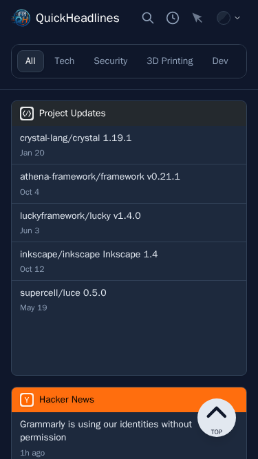
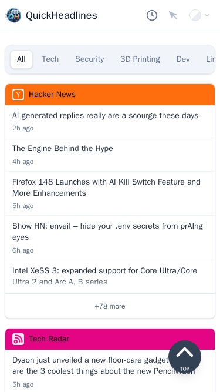
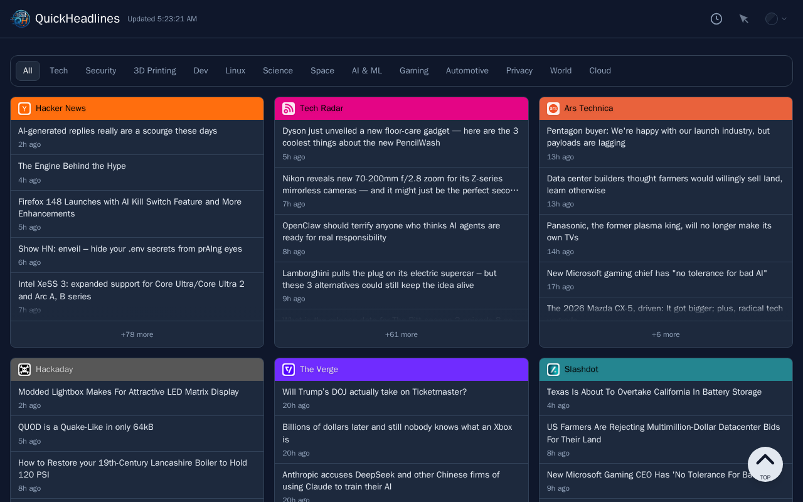
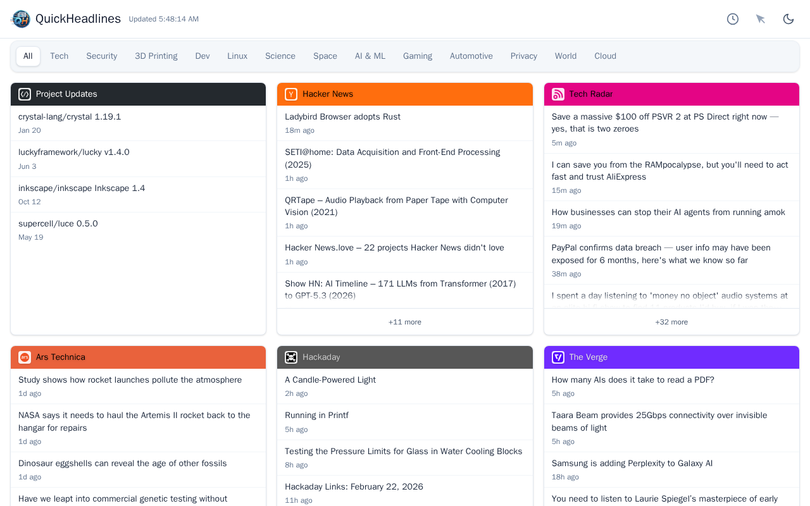
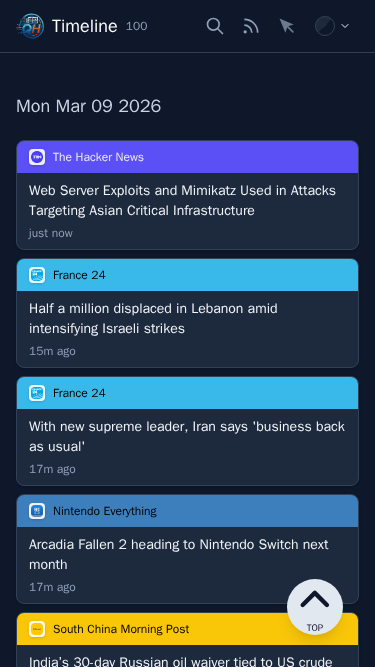
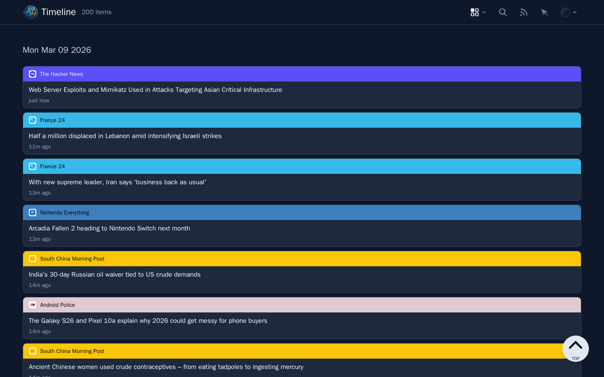
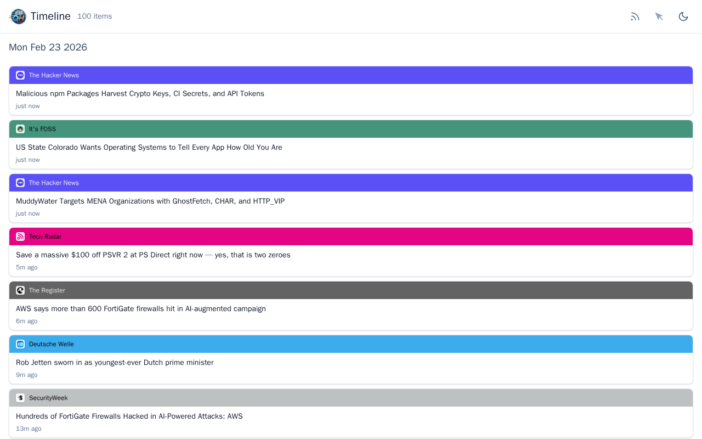

# Quick Headlines

Quick Headlines is an easily configurable and deployable recent feed dashboard. It allows you to organize your favorite RSS/Atom feeds and software releases into **tabs** for a clean, categorized view.

I wanted it to be as simple as dropping an executable and a YAML file with feeds in it. The aim is to have sane defaults, so you can get up and running quickly without fighting with it. It works great as a local dashboard or a hosted service.

## Features

- **Tabbed Interface**: Group feeds into logical categories (e.g., "Tech", "Dev", "News").
- **Timeline View**: Chronological view of all feed items with day grouping and time stamps.
- **Software Release Tracking**: Monitor releases from GitHub, GitLab, and Codeberg in a unified view.
- **Adaptive UI**: Automatically extracts colors from site favicons to style feed headers.
- **Dark Mode**: Built-in support with a toggle, including high-contrast scrollbars and scroll-indicators for Safari compatibility.
- **Live Updates**: Automatically refreshes feeds in the background and updates the UI without a page reload using [Morphodom](https://github.com/patrick-steele-idem/morphdom).
- **Authentication**: Support for Basic, Bearer token, and API Key authentication for private feeds.
- **Configurable Caching**: SQLite-based caching with configurable retention and size limits.
- **Health Monitoring**: Built-in health monitoring with CPU spike detection and error logging.
- **Lightweight**: Single binary deployment with minimal dependencies.

## Screenshots

Mobile (Dark Mode)           |  Mobile (Light Mode)
:-------------------------:|:-------------------------:
  |  

Desktop (Dark Mode)           |  Desktop (Light Mode)
:-------------------------:|:-------------------------:
  |  

---

### Timeline View

Mobile Timeline (Dark Mode)           |  Mobile Timeline (Light Mode)
:-------------------------:|:-------------------------:
  |  

Desktop Timeline (Dark Mode)           |  Desktop Timeline (Light Mode)
:-------------------------:|:-------------------------:
  |  

## Installation

Download the associated binary for your operating system from the Releases page. There are builds for Linux (arm64/amd64), FreeBSD (amd64), and macOS (arm64). You will also need to have the `feeds.yml` file in the same folder as the executable.  **Note for macOS users:** You must have OpenSSL 3 installed (`brew install openssl@3`) to run the binary.

## Building from Source

### Prerequisites

- **Crystal** (>= 1.18.2)
- **SQLite3** development libraries
- **OpenSSL** development libraries
- **Node.js/npm** (for Tailwind CSS CLI during build)

The Makefile will automatically check for these dependencies and provide installation instructions if any are missing.

### Platform-Specific Setup

#### Ubuntu / Debian

```bash
# Install Crystal compiler
curl -fsSL https://crystal-lang.org/install.sh | sudo bash

# Install system dependencies
sudo apt-get update
sudo apt-get install -y libsqlite3-dev libssl-dev pkg-config

# Clone and build
git clone https://github.com/kritoke/quickheadlines.git
cd quickheadlines
make build
```

#### Fedora / RHEL

```bash
# Install Crystal compiler
curl -fsSL https://crystal-lang.org/install.sh | sudo bash

# Install system dependencies
sudo dnf install -y sqlite-devel openssl-devel pkg-config

# Clone and build
git clone https://github.com/kritoke/quickheadlines.git
cd quickheadlines
make build
```

#### Arch Linux

```bash
# Install Crystal and dependencies
sudo pacman -S crystal sqlite openssl pkg-config

# Clone and build
git clone https://github.com/kritoke/quickheadlines.git
cd quickheadlines
make build
```

#### macOS

```bash
# Install Crystal and dependencies via Homebrew
brew install crystal openssl@3

# Clone and build
git clone https://github.com/kritoke/quickheadlines.git
cd quickheadlines
make build
```

#### FreeBSD

```bash
# Install Crystal and dependencies
pkg install crystal shards sqlite3 openssl node npm gmake

# Clone and build
git clone https://github.com/kritoke/quickheadlines.git
cd quickheadlines
gmake build
```

#### FreeBSD Jail Deployment (Bastille)

For automated FreeBSD jail deployment, the project includes:

- **misc/Bastillefile** - Bastille template for automated jail creation and configuration
- **misc/quickheadlines** - rc.d script for service management and supervision

These files set up the service user, cache directory at `/var/cache/quickheadlines`, and proper TLS certificates for feed fetching.

### Build Commands

- **Production Mode**: `make build` - Compiles optimized binary to `bin/quickheadlines`
- **Development Mode**: `make run` - Compiles and runs with live CSS reloading
- **Check Dependencies**: `make check-deps` - Verify all required dependencies are installed
- **Clean Build**: `make clean && make build` - Remove all build artifacts and rebuild

### Running the Application

```bash
# Run the compiled binary
./bin/quickheadlines

# Or use development mode
make run
```

The application will:

1. Auto-download `feeds.yml` from GitHub if missing
2. Create SQLite cache database on first run
3. Start listening on port 3030 on localhost unless you changed the port in the `feeds.yml` file.

### Cache Directory Configuration

QuickHeadlines stores feed data in an SQLite database for better performance. The cache directory location is determined by the following priority:

1. **Environment variable** `QUICKHEADLINES_CACHE_DIR`
2. **Config file** option `cache_dir` in `feeds.yml`
3. **XDG cache directory** `~/.cache/quickheadlines` (or `$XDG_CACHE_HOME/quickheadlines`)
4. **Fallback** `./cache` in the current directory

#### Setting the Cache Directory

**Via environment variable:**

```bash
export QUICKHEADLINES_CACHE_DIR=/var/cache/quickheadlines
./quickheadlines
```

**Via feeds.yml:**

```yaml
cache_dir: /var/cache/quickheadlines
```

**For production/Docker/jails:**
Use `/var/cache/quickheadlines` and ensure the directory is writable by the application user. The included FreeBSD Bastille template sets this up automatically.

**For development:**
The default `~/.cache/quickheadlines` location works well for local development.

### Cache Retention & Size Limits

QuickHeadlines automatically manages the SQLite cache database with configurable retention and size limits:

- **Default retention**: 168 hours (1 week) - feeds not fetched within this period are automatically cleaned up
- **Warning threshold**: 50MB - logs a warning when database exceeds this size
- **Hard limit**: 100MB - automatically removes oldest entries when database exceeds this size

#### Configuring Cache Retention

Add `cache_retention_hours` to your `feeds.yml`:

```yaml
cache_retention_hours: 168  # 1 week (default)
# cache_retention_hours: 720  # 30 days
# cache_retention_hours: 24   # 1 day
```

The application will:

1. Log database size on startup
2. Clean up feeds older than the retention period on each refresh
3. Automatically remove oldest entries if database exceeds 100MB
4. Log cleanup actions with details

**Note**: The cache retention setting is backwards compatible - if not specified, it defaults to 168 hours (1 week).

## Usage

Edit the `feeds.yml` file to add your own content. It only requires a feed title and URL; other properties have sane defaults.

### Global Configuration Options

```yaml
refresh_minutes: 10           # Refresh interval in minutes (default: 10)
item_limit: 10                 # Default number of items per feed (default: 10)
server_port: 3030              # HTTP server port (default: 3030)
page_title: "Quick Headlines" # Page title (default: "Quick Headlines")
cache_retention_hours: 168     # Cache retention in hours (default: 168 = 1 week)
```

### HTTP Client Configuration

Configure global HTTP client settings:

```yaml
http_client:
  timeout: 30              # Read timeout in seconds (default: 30)
  connect_timeout: 10      # Connection timeout in seconds (default: 10)
  user_agent: "QuickHeadlines/0.3"  # Custom User-Agent header
```

### Feed-Specific Configuration

Each feed can override global settings:

```yaml
tabs:
  - name: "Tech"
    feeds:
      - title: "Hacker News"
        url: "https://news.ycombinator.com/rss"
        header_color: "orange"  # Header background color
        item_limit: 20          # Override global item limit
        max_retries: 5          # Retry attempts on failure (default: 3)
        retry_delay: 3          # Base delay between retries in seconds (default: 5)
        timeout: 45             # Request timeout in seconds (default: 30)
```

### Authentication

Feeds can require authentication. Supported types: `basic`, `bearer`, `apikey`:

```yaml
tabs:
  - name: "Private"
    feeds:
      - title: "Internal Feed"
        url: "https://example.com/private/feed.xml"
        auth:
          type: "basic"              # Authentication type
          username: "user"           # Username for Basic auth
          password: "pass"           # Password for Basic auth
          # OR for Bearer/API Key:
          # type: "bearer"
          # token: "your-token-here"
          # header: "Authorization"  # Custom header name (default)
          # prefix: "Bearer "        # Value prefix (default: "")
```

### Software Releases

Monitor releases from GitHub, GitLab, and Codeberg:

```yaml
    software_releases: 
      title: "Software Releases" # optional, defaults to Software Releases
      repos:
        - "crystal-lang/crystal"          # Defaults to GitHub
        - "inkscape/inkscape:gl"          # :gl for GitLab
        - "supercell/luce:cb"             # :cb for Codeberg
```

## Docker Image

You should be able to use the following docker image ```ghcr.io/kritoke/quickheadlines:latest``` to get the latest package.

## Performance & Memory Tuning

For long-running instances, especially in resource-constrained environments like Docker containers or FreeBSD jails, you can tune the Garbage Collector (Boehm GC) using environment variables to maintain a flat memory footprint:

- `GC_MARKERS=1`: Limits the number of parallel markers. Recommended for systems with low CPU core counts to reduce thread overhead.
- `GC_FREE_SPACE_DIVISOR=20`: Makes the GC more aggressive about reclaiming memory and returning it to the OS. Increasing this value (default is ~3) helps prevent slow memory growth over time.

### Setting Variables

Add them to your docker-compose.yml or docker run command (these are already made on the included docker/docker-compose files):

```yaml +environment:
GC_MARKERS=1
GC_FREE_SPACE_DIVISOR=20
```

## Contributing

1. Fork it (<https://github.com/kritoke/quickheadlines/fork>)
2. Create your feature branch (`git checkout -b my-new-feature`)
3. Commit your changes (`git commit -am 'Add some feature'`)
4. Push to the branch (`git push origin my-new-feature`)
5. Create a new Pull Request

## Contributors

- [kritoke](https://github.com/kritoke) - creator and maintainer

## License

This project is licensed under the GNU Affero General Public License v3.0 - see the [LICENSE](LICENSE) file for details.
